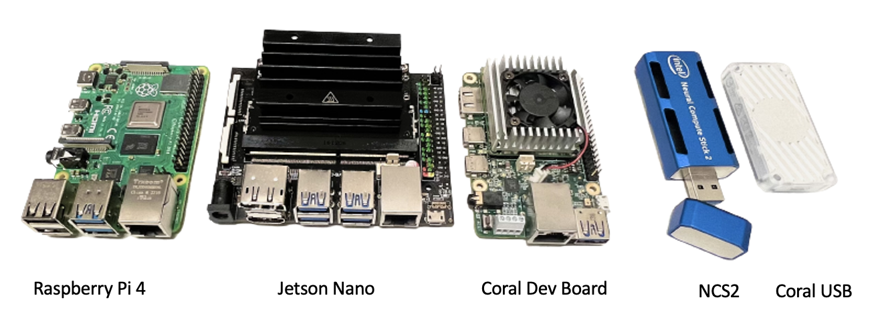
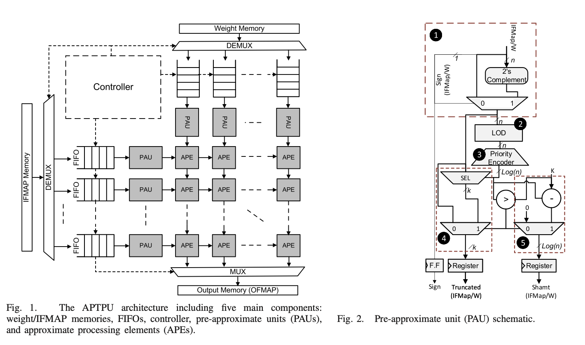
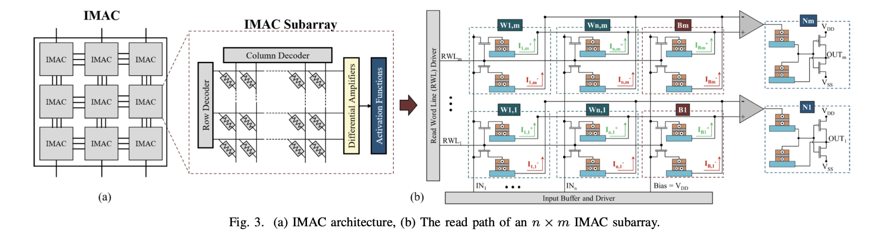
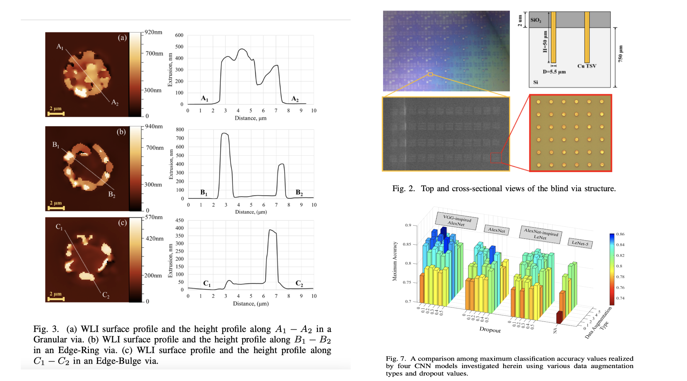

# Brendan Reidy
# Table of Contents
1. [Research](#Research)
2. [Projects](#Projects)
3. [Project Graveyard](#Project-Graveyard)
4. [Publications](#Publications)
## Research

###  Transformer Accelerator (2022)

- **Description:** Transformer models have become a dominant architecture in the world of machine learning. However, this increase in performance has come at the cost of ever-increasing model sizes requiring more resources to deploy. To address these issues, several edge AI accelerators have been developed. Here, we **develop a methodology to deploy** large natural language **models** (300+ million weights) **on edge devices** (Coral TPU Dev Board, Coral USB, Intel NCS2, Jetson Nano) for real-time integer inference achieving a **4x memory footprint reduction**, **14x latency reduction**, and **35x energy reduction** over baseline model. We provide extensive latency, power, and energy
comparisons among the leading edge devices and show that our methodology allows for real-time inference of large Transformers while maintaining the lowest power and energy consumption of the leading edge devices on the market.
- **Keywords:** Machine Learning, Tensor Processing Unit (TPU), Transformer Models, Edge AI Accelerators, GPU, VPU, BERT, Hardware Accelerator, Quantization

###  Approximate Tensor Processing Unit (APTPU) (2022)

- **Description:** Deep learning workloads demand high resource utilization and frequent memory accesses, and thus require well-engineered memory bandwidth optimization. Thus, we propose an approximate tensor processing unit (APTPU). We conduct extensive experiments to evaluate the performance of the APTPU across various configurations and various workloads. A comparison with the state-of-the-art approximate systolic arrays shows that the APTPU can realize up to **1.58×, 2×, and 1.78×, reduction in delay, power, and area, respectively**, while using similar design specifications and synthesis constraints.
- **Keywords:** Machine Learning, Hardware Acceleration, Approximate Computing, Quantization, Tensor Processing Unit, FPGA, Neural Networks
- [Website](https://www.icaslab.com/research/approximate-computing-based-ai-accelerator) \| [Paper](https://ieeexplore.ieee.org/abstract/document/9901385) \| [Code](https://github.com/iCAS-Lab/AP-TPU)

---
###  In-Memory Analog Computing (2021)

- **Description:** One of the major limitations of implementing deep learning models on mobile computing devices is their limited computing power and severe energy constraints. As alternatives to von Neumann architectures, in-memory computing (IMC) and near-memory computing (NMC) architectures aim to address these issues through performing processing within or near storage devices, respectively. We develop an in-memory analog computing (IMAC) architecture realizing both synaptic behavior and activation functions within non-volatile memory arrays. It is shown the proposed IMAC architecture can be utilized to realize a multilayer perceptron (MLP) classifier **achieving orders of magnitude performance improvement** compared to previous mixed-signal and digital implementations. 
- **Keywords:** Machine Learning, Analog Computing, In-Memory Computing, Quantization, Binary Neural Networks, Ternary Neural Networks, Convolutional Neural Networks
- [Website](https://www.icaslab.com/research/imac) \| [Paper](https://ieeexplore.ieee.org/abstract/document/9516756) (**Best Paper Award**) \| [Code](https://github.com/BrendanCReidy/Java-ML-Framework)

---
### ML for 3D IC Reliability (2020)

- **Description:** Through Silicon Via (TSV) extrusion is a crucial reliability concern which can deform and crack interconnect layers in 3D ICs and cause device failures. We develop a TSV extrusion morphology dataset, where images are categorized into three morphology classes and then train a convolutional neural network (CNN). Our model acheives near-expert accuracy for TSV morphology classification.
- **Keywords:** Machine Learning, 3D IC, Convolutional Neural Networks
- [Website](https://www.icaslab.com/research/ml-3d-ic-reliability) \| [Paper 1](https://ieeexplore.ieee.org/abstract/document/9356292) \| [Paper 2](https://ieeexplore.ieee.org/abstract/document/9501584) \| [Code](https://github.com/iCAS-Lab/Deep-Morphology)

## Projects
###  CUDA/C++ Deep Neural Network Platform (2021)

- **Description:** A GPU implementation of the [code](https://github.com/BrendanCReidy/Java-ML-Framework/blob/master) used in this [paper](https://ieeexplore.ieee.org/abstract/document/9516756). The program uses *vanilla* CUDA/C++. This code-base is used for training DNNs with full GPU utilization using specialized CUDA Kernels. This program is over **10x faster** than the Java implementation.
- **Keywords:** Machine Learning, C++, CUDA, Hardware-Acceleration, Parallel Programming, GPU
- [Code](https://github.com/iCAS-Lab/CUDA-Neural-Network)

---
## Project Graveyard
Here lies the projects I worked on for weeks (or sometimes months) but didn't completely finish. Although these projects aren't finished there's a lot of good stuff in here:
#### Planet Exploration Game (Mar 2022)

##### Each colored dot on screen is an explorable planet
  - Description: The goal of this project was to create a multi-player game where players could explore an infinite universe with diverse planets. Each planet would have different materials that can be mined by the player. Players can build ships, build their base, mine for resources, craft, and explore planets.
  - Keywords: Procedural terrain generation, client-server interactions, user interface, inventory systems, 3D physics
  - [More Info](/planet_exploration)

---
## Publications

- ME Elbtity, PS Chandarana, **B Reidy**, JK Eshraghian, R Zand., "[APTPU: Approximate Computing Based Tensor Processing Unit](https://ieeexplore.ieee.org/abstract/document/9901385)," *IEEE Transactions on Circuits and Systems I: Regular Papers*, vol. 69, no. 12, pp. 5135-5146, Dec. 2022
- ***(Best Paper Award)*** ME Elbtity, A Singh, **B Reidy**, X Guo, R Zand., "[An In-Memory Analog Computing Co-Processor for Energy-Efficient CNN Inference on Mobile Devices](http://example.com/)," *2021 IEEE Computer Society Annual Symposium on VLSI (ISVLSI)*, 2021
- G Jalilvand, J Lindsay, **B Reidy**, V Shukla, D Duggan, R Zand, T Jiang., "[Application of Machine Learning in Recognition and Analysis of TSV Extrusion Profiles with Multiple Morphology](https://ieeexplore.ieee.org/abstract/document/9501584)," *2021 IEEE 71st Electronic Components and Technology Conference (ECTC)*.
- **B Reidy**, G Jalilvand, T Jiang, R Zand., "[TSV Extrusion Morphology Classification Using Deep Convolutional Neural Networks](https://ieeexplore.ieee.org/abstract/document/9356292)," *2020 19th IEEE International Conference on Machine Learning and Applications (ICMLA)*
- **B Reidy** and R Zand., "[SOT-MRAM based Sigmoidal Neuron for Neuromorphic Architectures](https://arxiv.org/abs/2006.01238)," *2020 arXiv*.