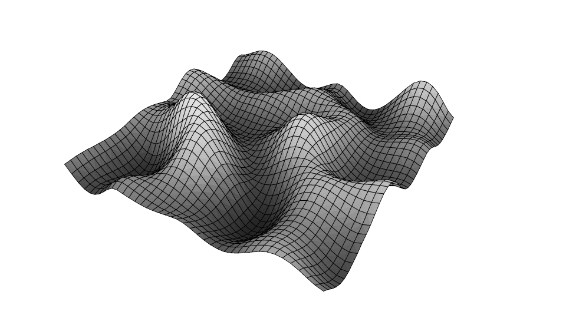
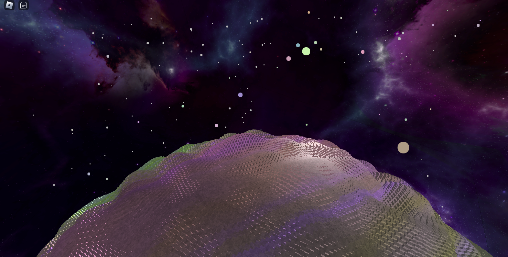

## [Main Page](/README)
## Planet Exploration Game (March 2022)
**Project description:** The goal of this project was to create a game where players could explore an infinite universe with diverse planets. Each planet would have different materials that can be mined by the player. Players can build ships, build their base, and explore planets.

### Section 1:  Inventory System
#### 1.1 Inventory UI
Players open their inventory by pressing <kbd>g</kbd> on the keyboard. When the mouse hovers over an object, the item name, quantity, and description are displayed.
##### Inventory UI Demo


Players can equip items in their hotbar using the keyboard buttons <kbd>1</kbd>-<kbd>5</kbd>. (This can be seen in 1.2 and 1.3) Items drop on death and can be picked up if the player returns to get them. All items are either used for: tools, crafting, or building.

##### Crafting Demo


#### 1.2 Mining
Users can break items using pickaxe. Different items have different durability and float on the ground when broken. Items are *pulled* towards the user when they get close and added to their inventory when they touch the character.

##### Mining Demo


#### 1.3 Building
There are two building engines in the game: general purpose building and ship building. General purpose building is used for building things like bases. This type of building does not use physics so blocks placed for general building are stationary. Ship building on the other hand allows the user to build their own space ship which can be compiled if: A) the ship has 1 or more engine and B) the ship has a "captains chair" which is used for steering the ship. Only blocks that are connected to the captains chair (directly or indirectly) will become part of the final spaceship.

##### Ship Building Demo

Here we see a hyper-realistic space ship made by yours truly (I never claimed to be an artist).
The red outline indicates that the blocks are not connected to a captains chair, and therefore will not become part of the ship after ship compilation. They turn green once the captains chair is place indicating that they are part of the ship.

After this the user can compile their ship and its off to infinity and beyond (the red cube is a debug cube used as the center of rotation)


I have yet to show any code so just to give a taste of whats under the hood here is an excerpt from the FlyModule that updates every game tick
```Lua
RunService.RenderStepped:Connect(function(step) -- at each game tick
  self:SetNormal(self:GetNormal()) -- set the normal vector to the current normal
  if self.flying then -- do this if we're in fly mode
    local mouseOffset = screenCenter - Vector2.new(mouse.X, mouse.Y) -- get distance of mouse from center of screen
    local roll = math.asin(mouseOffset.X / mouseOffset.Magnitude) -- use mouse distance from center in x axis as the "roll" component of the ship
    local cf = CFrame.new(center.Position, center.Position + mouse.UnitRay.Direction) -- this creates a vector starting at argument 1, looking at argument 2.
    --Argument 1 is the center of rotation for the ship
    --Argument 2 is the center of rotation for the ship, plus an offset which is a ray to the mouse’s position in 3d space
    -- This gives us a position and rotation matrix (aka CFrame) where the position is the current position of the center of rotation and
    local pitch, yaw, _ = cf:ToEulerAnglesYXZ()
    -- For flying aesthetic reasons, we only use the pitch and yaw components of this CFrame,
    -- and we use the roll component of the x axis based roll (will show this)
    
    self.oreintation.CFrame = CFrame.new(cf.Position)*CFrame.fromEulerAnglesYXZ(pitch, yaw, roll) -- this updates the position and rotation of our ship
    --     ^ i before e except after c... oops
  end
end)
```

UnitRay Pitch, Yaw, Roll            |  UnitRay Pitch, Yaw; asin(dx) Roll
:-------------------------:|:-------------------------:
  |  

### Section 2: Procedural Planet Generation: 

#### 2.1 Infinite Procedural Planets
Players can explore an infinite universe using planets that are procedurally generated. The planets are generated using Perlin noise. Planets are rendered lazily (only a circle) until the player gets close, then they are generated again using perlin noise. 
##### Perlin Noise Example


##### Infinite Planets

###### *each colored dot is an explorable planet*
#### 2.2 Planet Gravity
Each planet has its own gravity and can be explored by the player.


Planets are generated using the [fibonacci sphere](https://arxiv.org/pdf/0912.4540.pdf) algorithm. We use sin(x) and sin(y) as the input to the perlin noise, and use the output as the distance from the center to draw spheres with procedurally generated hills and valleys. The color is also generated using perlin noise to give planets a unique feel. 

This is as far as I got with this project. Although this is not a project I currently work on, it exposed me to procedural terrain generation, client-server interactions, UI systems, inventory systems, 3D physics, and more.